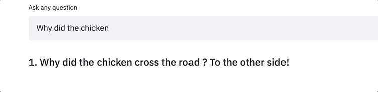
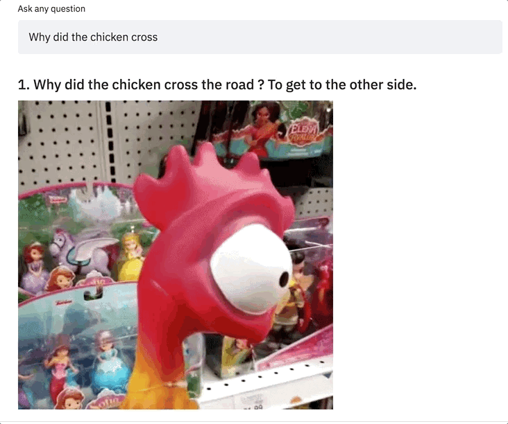
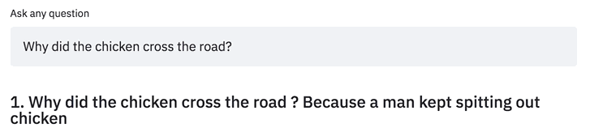
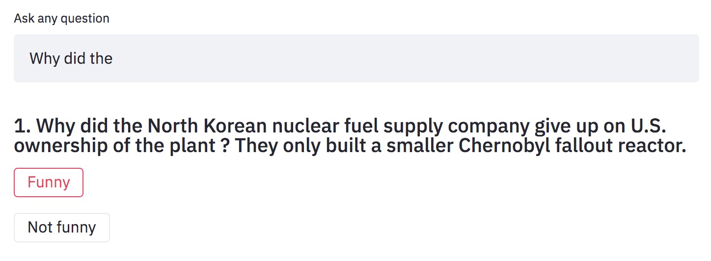

# Hi, I am [Tito Joker](http://35.225.94.177:8501/)! :wave: :grinning:
[](https://www.gnu.org/licenses/gpl-3.0)
[](https://travis-ci.com/enzoampil/tito-joker)
[](http://35.225.94.177:8501/)
[](https://github.com/ambv/black)
## A humorous AI that uses state-of-the-art deep learning to tell jokes

**Tito Joker** aims to understand humor well enough to tell jokes that are actually funny. All you have to do is input a riddle type question and he tells a joke using it. He still has a long way to go but we will get there!



Interact with Tito Joker on this [website](http://35.225.94.177:8501/) and check out his [medium article](https://towardsdatascience.com/can-a-robot-make-you-laugh-teaching-an-ai-to-tell-jokes-815f1e1e689c?source=friends_link&sk=342342be4cbf0064f8f0e7cb7ec0b6bc)!

## Generate GIFs automatically 
*Turned off by default - turn on from left sidebar*



## Tell multiple jokes from a single input
*Tito Joker can give unique responses to the same input*



## Joke rating system
*Help Tito Joker improve his humor by giving him feedback!*



## Methodology

### Architecture
Fine-tuned version of the recently released [OpenAI GPT-2 model](https://openai.com/blog/gpt-2-1-5b-release/) with a left-to-right language modeling training objective. Similar hyperparameters were used from the [original paper](https://d4mucfpksywv.cloudfront.net/better-language-models/language_models_are_unsupervised_multitask_learners.pdf).

### Data
A [jokes dataset](https://www.kaggle.com/abhinavmoudgil95/short-jokes) from Kaggle was used for fine-tuning. Aside from the original preprocessing, additional special tokens were added to allow the model to understand the difference between the "question" and "answer" components of a riddle type joke.

*Warning: the dataset contains NSFW jokes, so Tito Joker's humour will also reflect jokes of this nature.*

To learn more, please refer to Tito Joker's [medium article](https://towardsdatascience.com/can-a-robot-make-you-laugh-teaching-an-ai-to-tell-jokes-815f1e1e689c?source=friends_link&sk=342342be4cbf0064f8f0e7cb7ec0b6bc) on Towards Data Science.

## Preparing the data
```
python ./src/utils/process_jokes.py shortjokes.csv ./data/riddle_jokes.txt
```

## Training the model
Please refer to the experiment [notebooks](https://github.com/enzoampil/tito-joker/tree/master/experiments).

*Note: The number at the end of the notebook's filename corresponds to the model version it produces (no number means 1)*

## Trained models
1. [Tito Joker v1 (OpenAI GPT-2)](https://storage.googleapis.com/joke-generator-model1/model1.zip)
2. [Tito Joker v2 (OpenAI GPT-2)](https://storage.googleapis.com/joke-generator-model1/model2.zip)

## Acknowledgments

Special thanks to [Hugging Face](https://huggingface.co/) for their implementation of OpenAI GPT-2 using PyTorch, [Streamlit](https://streamlit.io/) for making it super easy to deploy Tito Joker as a webapp.

## About

**Why is the AI named Tito Joker?** Because in Filipino, "tito" means "uncle" when translated to English, and in the Philippines, we all have that uncle who says the corniest jokes!
